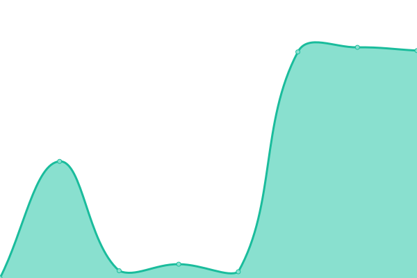
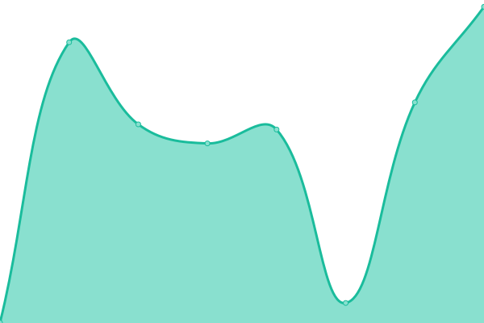
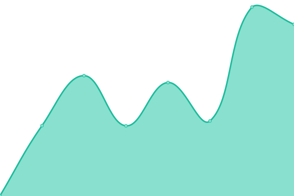
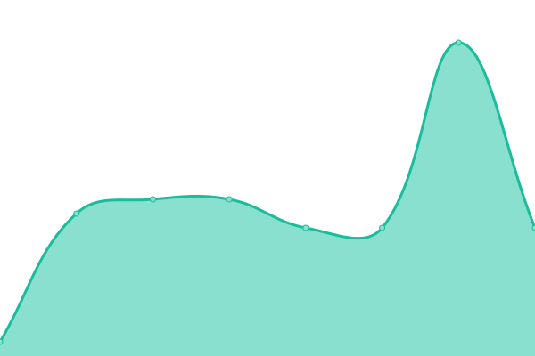
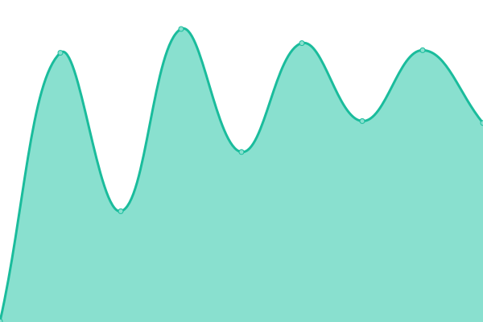

# [📈 Live Status](https://status.onekuma.cn): <!--live status--> **🟧 Partial outage**

This repository contains the open-source uptime monitor and status page for [XLor](https://onekuma.cn), powered by [Upptime](https://github.com/upptime/upptime).

With [Upptime](https://upptime.js.org), you can get your own unlimited and free uptime monitor and status page, powered entirely by a GitHub repository. We use [Issues](https://github.com/yjl9903/upptime/issues) as incident reports, [Actions](https://github.com/yjl9903/upptime/actions) as uptime monitors, and [Pages](https://status.onekuma.cn) for the status page.

<!--start: status pages-->
<!-- This summary is generated by Upptime (https://github.com/upptime/upptime) -->
<!-- Do not edit this manually, your changes will be overwritten -->
<!-- prettier-ignore -->
| URL | Status | History | Response Time | Uptime |
| --- | ------ | ------- | ------------- | ------ |
|  [Home](https://onekuma.cn) | 🟩 Up | [home.yml](https://github.com/yjl9903/upptime/commits/HEAD/history/home.yml) | 

 286ms
     
 | 

<a href="https://status.onekuma.cn/history/home">100.00%</a>
    

|  [Blog](https://blog.onekuma.cn) | 🟥 Down | [blog.yml](https://github.com/yjl9903/upptime/commits/HEAD/history/blog.yml) | 

 14866ms
     
 | 

<a href="https://status.onekuma.cn/history/blog">0.00%</a>
    

|  [Hexo](https://xlor.cn) | 🟩 Up | [hexo.yml](https://github.com/yjl9903/upptime/commits/HEAD/history/hexo.yml) | 

 379ms
     
 | 

<a href="https://status.onekuma.cn/history/hexo">100.00%</a>
    

|  [Anime Garden](https://animes.garden) | 🟩 Up | [anime-garden.yml](https://github.com/yjl9903/upptime/commits/HEAD/history/anime-garden.yml) | 

 547ms
     
 | 

<a href="https://status.onekuma.cn/history/anime-garden">100.00%</a>
    

|  [Anime Garden - API](https://animes.garden/api/) | 🟩 Up | [anime-garden-api.yml](https://github.com/yjl9903/upptime/commits/HEAD/history/anime-garden-api.yml) | 

 1876ms
     
 | 

<a href="https://status.onekuma.cn/history/anime-garden-api">100.00%</a>
    

|  [Anime Garden - Feed](https://api.animes.garden/) | 🟩 Up | [anime-garden-feed.yml](https://github.com/yjl9903/upptime/commits/HEAD/history/anime-garden-feed.yml) | 

 12ms
     
 | 

<a href="https://status.onekuma.cn/history/anime-garden-feed">100.00%</a>
    

|  [KeepShare](https://keepshare.org/gv78k1oi/magnet%3A%3Fxt%3Durn%3Abtih%3AULRHXZU7IHGEIVKIXMRIGSRHSY26K7TF) | 🟩 Up | [keep-share.yml](https://github.com/yjl9903/upptime/commits/HEAD/history/keep-share.yml) | 

 4548ms
     
 | 

<a href="https://status.onekuma.cn/history/keep-share">99.77%</a>
    

|  [Livehouse](https://live.onekuma.cn/) | 🟩 Up | [livehouse.yml](https://github.com/yjl9903/upptime/commits/HEAD/history/livehouse.yml) | 

 272ms
     
 | 

<a href="https://status.onekuma.cn/history/livehouse">100.00%</a>
    

|  [弥希 Miki 舰长日报](https://miki.xlor.cn/) | 🟥 Down | [miki.yml](https://github.com/yjl9903/upptime/commits/HEAD/history/miki.yml) | 

 316ms
     
 | 

<a href="https://status.onekuma.cn/history/miki">99.99%</a>
    

<!--end: status pages-->

[**Visit our status website →**](https://status.onekuma.cn)

## 📄 License

- Powered by: [Upptime](https://github.com/upptime/upptime)
- Code: [MIT](./LICENSE) © [XLor](https://onekuma.cn)
- Data in the `./history` directory: [Open Database License](https://opendatacommons.org/licenses/odbl/1-0/)
